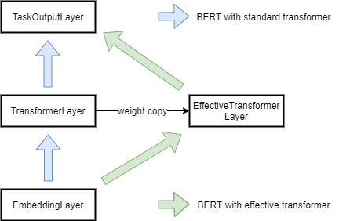

# How to use  
  
We take [cloze task](https://en.wikipedia.org/wiki/Cloze_test) using Google's official pretrained language model [BERT](https://storage.googleapis.com/bert_models/2020_02_20/uncased_L-12_H-768_A-12.zip) as an example to show the usage of `effective_transformer` package.  
  
A typical BERT model can be split into 3 parts: `EmbeddingLayer`, `TransformerLayer` and `TaskOutputLayer`.   
What we want to do here is building an `EffectiveTransformerLayer` to replace the original `TransformerLayer` so that the model can be served super fast.  
  
<div align=center></div>  


  
## Create effective transformer layer
To copy weights of standard transformer layer to effective transformer layer, we create a standard transformer layer and restore weights from ckpt file:
```python
TransformerLayer(bert_config, input_embedding_placeholder, input_mask_placeholder) 
with tf.Session() as sess:  
        saver = tf.train.Saver()  
        saver.restore(sess, checkpoint_path)  
        all_vars = tf.get_collection(tf.GraphKeys.TRAINABLE_VARIABLES)  
        transformer_vars = [v.name for v in all_vars if 'layer' in v.name]  
        weights_value = sess.run(transformer_vars)  
```
After weights are restored, reset the computation graph:
```python
tf.reset_default_graph()  
```
Then we create the effective transformer layer using weights restored:
```python
effective_transformer_layer = EffectiveTransformerLayer(batch_size, max_seq_len, bert_config, attention_mask_placeholder, input_mask_placeholder, input_embedding_placeholder, weights_value)  
```

## Create other layers
Create embedding layer and output layer:
```python
embedding_layer = EmbeddingLayer(bert_config, input_ids_placeholder)  
output_layer = LanguageModelOutputLayer(bert_config, transformer_output_placeholder, embedding_table_placeholder)
```
Restore weights of these layers:
```python
variables_to_restore = tf.get_collection(tf.GraphKeys.TRAINABLE_VARIABLES)  
saver = tf.train.Saver(variables_to_restore)
with tf.Session() as sess:  
	saver.restore(sess, checkpoint_path)
```
Build the computation graph (note that `EffectiveTransformerLayer` need `attention_mask` as input):
```python
	input_embedding, embedding_table = sess.run([embedding_layer.get_embedding_output(), embedding_layer.get_embedding_table()], feed_dict={input_ids_placeholder: input_ids})  
	attention_mask = sess.run(create_attention_mask_from_input_mask(input_ids_tensor, input_mask_tensor))  
	transformer_output = sess.run(effective_transformer_layer.get_transformer_output(), feed_dict={input_embedding_placeholder: input_embedding, attention_mask_placeholder: attention_mask, input_mask_placeholder: input_mask})  
	outputs = sess.run(output_layer.get_predict_probs(), feed_dict={transformer_output_placeholder: transformer_output, embedding_table_placeholder: embedding_table})
```
Now, the whole model with effective transformer is created.

## Run and enjoy the speed!
Install `effective_transformer` package by:
```bash
git clone https://github.com/bytedance/effective_transformer.git
cd effective_transformer/python
python setup.py install
```
Then, run the task:
```bash
python run_cloze_task.py -d bert_model_path --effective_mode
```
The output should be like:
```
time cost:  2.987051 s
Q: What a _ day !
A: [('beautiful', 0.22004957), ('wonderful', 0.18434832), ('lovely', 0.12934665), ('great', 0.084521234), ('nice', 0.053840164)]
Q: Effective transformer is _ fast !
A: [('very', 0.2847082), ('so', 0.12541212), ('too', 0.12115073), ('extremely', 0.04300181), ('not', 0.031808525)]
```
compared to the output of original BERT:
```
time cost:  7.224578 s
Q: What a _ day !
A: [('beautiful', 0.22005162), ('wonderful', 0.18434829), ('lovely', 0.12934624), ('great', 0.08452097), ('nice', 0.053839635)]
Q: Effective transformer is _ fast !
A: [('very', 0.28470847), ('so', 0.12541331), ('too', 0.121151075), ('extremely', 0.043001525), ('not', 0.03180822)]
```  

## Benchmark
To reproduce the [benchmark](https://github.com/bytedance/effective_transformer#Performance) presented in repo home page, run
```bash
python benchmark.py -p fp32
```
The output should be like:
```
Valid word num : 2502/4096, avg sequence length : 19.5469 
max diff : 6.67572e-06, avg diff : 4.02369e-06.
xla cost : 95.0982 ms
et  cost : 57.7004 ms
```

## Run with fp16
The original `modeling.py` file and pretrained BERT model in [bert](https://github.com/google-research/bert) repo set float tensors to fp32.

In order to support fp16, we rewrite the functions in `modeling.py` by passing an additional parameter `tf_dtype` and apply post-training fp16 quantization to saved model.

Then we can run benchmark and cloze task with fp16 by setting argument `-p` to `fp16`.
